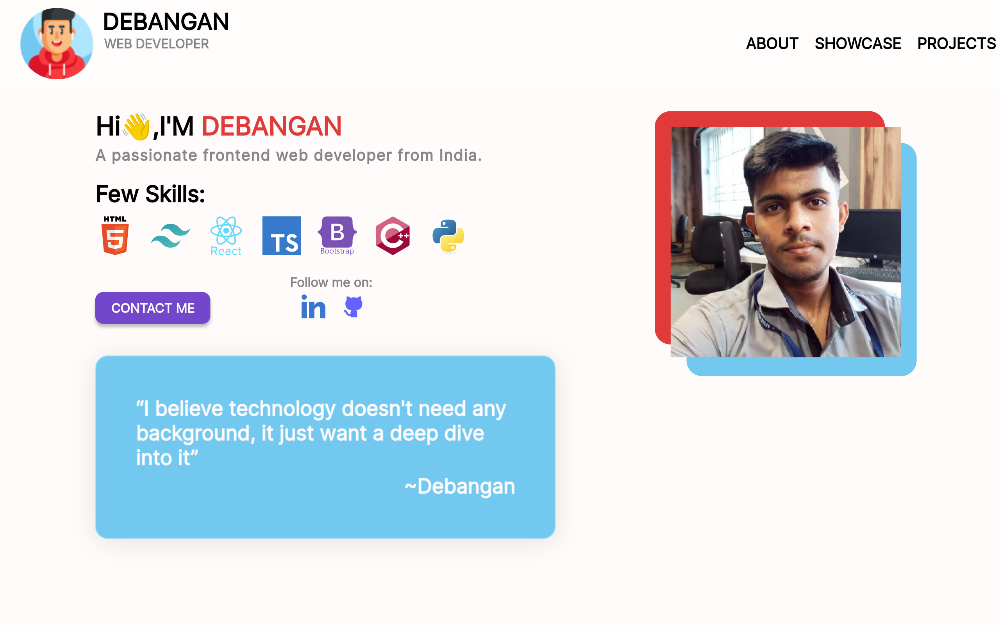
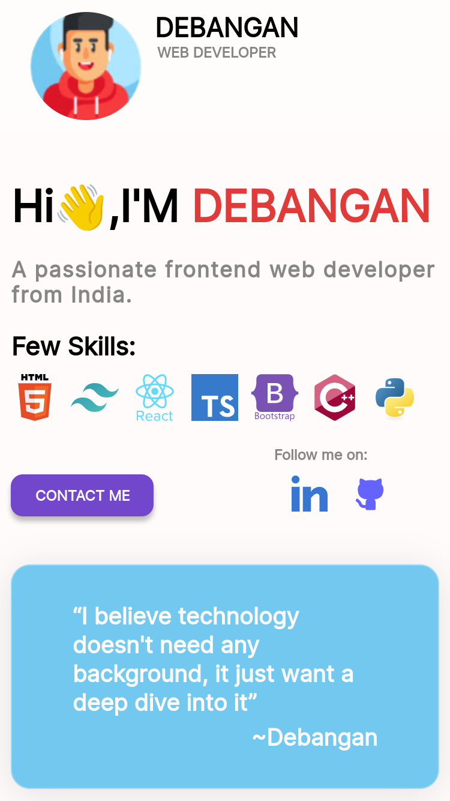

## This is my simple playfull ui portfolio

> It's created using only pure html & css

<h3 style="color:#E03A3A"> Preview: </h3>

[🔗Portfolio link🔗](https://debangan202ok.github.io/Porfolio/)

 

> It's full responsive in desktops, tablets & Mobiles

<h4> Preview </h4>

### Redesign by your own and make it more interactive.

> #### Installation

1. ##### Clone this Repository: `git clone https://github.com/pauldebangan1970/Porfolio.git`
2. ##### Navigate to the project directory: `cd __directory_name__`
3. ##### Install dependencies using: `npm install`
4. ##### Enjoy 🥳 & Design 👩‍💻 